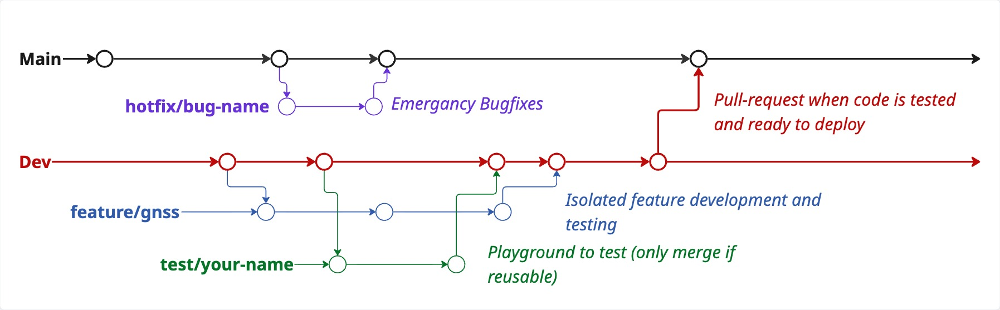

# project-polaris


<table style="border: none; border-collapse: collapse;">
 	<tr>
        <td valign="middle" style="border: none; padding-left: 12px;">
 			<p style="margin:4px 0 0 0"><strong>POLARIS Focus Project 2026</strong><br/>
 			<em>Our goal is to develop and deploy an autonomous underwater vehicle that is capable of navigating in frozen lakes, with freezing conditions and take ice-thickness measurements from beneath the ice.</p>
 		</td>
 		<td width="140" valign="middle" style="border: none; padding: 0;">
 			
 		</td>
 	</tr>
</table>

---

### Getting Started

**0. Prerequisites**
 This repo is made for ROS2-humble, which runs on Ubuntu 22.04.

**1. Clone Repository**
Go to directory where you want to store your repo and clone:
```bash
cd Documents/here-i-want-my-repo
git clone https://github.com/aris-space/project-polaris.git
```


**2. Run on Docker container**
 Work in progress...
 Our docker images are stored in a seperate Github Repo, you can find it here: https://github.com/aris-space/project-polaris-docker

 To pull the docker image use:
 ```
docker pull ghcr.io/aris-space/project-polaris-docker:<container-image>
 ```

**3. Build ROS2 Packages**
 Should be done on it's own when you run your docker container.
 If there is need to build them again use:
 ```
 colcon build --symlink-install
 ```
See https://colcon.readthedocs.io/en/released/ for documentation.

---
### Usage
Work in progress...

---

### Repository Structure
**.github**
 Here your git-specific files are stored that are needed for example to automate workflows.

**config**
 Contains configuration files to collect essential shared variables that can be adjusted here.

**docs**
 Documents that have nothing to do with code, for example pdf's, pictures,...
 
**(launch)**
 Store launch files like (from ROS as example) here, s.t. they don't have to be searched in subfolders.

**scripts**
 Drop off your random scripts that are not essential for operation but might come in handy some time. Every folder in root should have a script folder. If there's none yet feel free to create it yourself.

**src**
 The main directory for all our code packages.

>**src/hardware**
 Packages that handle sensors, cameras and motors (excluded are packages that have their own directory e.g. navigation)

>**src/measurement**
 Packages that handle ice-thickness measurements

>**src/missionplanner**
 Packages that handle autonomy, pathfinding,...

>**src/navigation**
 Packages that handle navigation which includes sensors needed for localization (pressure, imu, dvl, gnss)

>**src/prototypes**
 Old code packages will be stored here. This directory is basically an archive for old code.

>**src/simulation**
 Packages that run simulations like gazebo is stored here.

**(utils)**
 Here would belong code that stores classes or functions that make our lives easier.

**.gitignore**
 Everything that is not needed in the main repo should be put on this list. This is done to keep a clean main repo. Examples for files that should be put in this list are: Any kind of log files, pycache folders, ROS2 artifacts, etc.

---

### Workflow for implementing a new feature:

**Setup:**
 Always begin by going to the develop branch.
 Create a separate branch for the new feature to keep changes isolated.


**Developing the Feature:**
 Implement the feature and test it thoroughly.
 Make regular commits with clear descriptions of changes.
 Make sure that everything is properly commented, so that the reviewers and future you understand the code
 Document non-code related information in Notion, e.g. hardware setup guides, wiring charts, configuration steps etc.
 Push the branch to the remote repository to ensure changes are tracked.


**Opening a Pull Request:**
 Once the feature is working, create a pull request to merge the feature branch into develop.
 At least two team members must review and approve the pull request.
 Address any feedback and make necessary improvements.


**Merging into Develop for integration:**
 After approval, merge the feature branch into develop, where you can integrate it into the repo before merging it into main.


**Merging into Main:**
 When the develop branch reaches a stable and fully integrated state, it is merged into the main branch.
 If applicable, tag the new version and prepare for deployment.
 Update any relevant documentation.


**Branching Strategy:**
<td width="140" valign="middle" style="border: none; padding: 0;">
                 
             </td>

---

### Style Guide
We follow a cut-down version of the general python style guide from google. To make the code look uniform we use black formatter.
See **Notion -> SW Wiki -> Good Coding Practices -> Styleguide** for more detailed descriptions and guides.